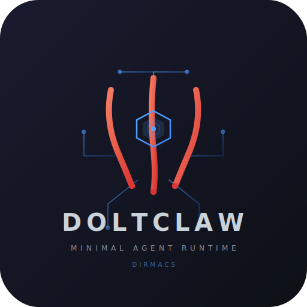

<p align="center">
  
</p>

<p align="center">
  <strong>doltclaw — Minimal agent runtime</strong>
</p>

<p align="center">
  <a href="https://github.com/dirmacs/doltclaw/actions"></a>
  <a href="LICENSE"></a>
  
  
  
  
</p>

---

**doltclaw** is a minimal Rust agent runtime — LLM inference, model fallback chains, and tool calling in 1,652 lines. Part of the [claw family](https://github.com/openclaw/openclaw) (openclaw, [zeroclaw](https://github.com/zeroclaw-labs/zeroclaw), [openfang](https://github.com/RightNow-AI/openfang), nullclaw, picoclaw, nanoclaw). Built for the [dirmacs](https://github.com/dirmacs) ecosystem, works with any OpenAI-compatible API.

Named after the claw that cuts clean — no bloat, no runtime, no Node.js. Just function.

## Why doltclaw

- **1,652 lines** — small enough to understand, audit, and modify
- **2.9MB binary** — vs openclaw's ~500MB install
- **1.4MB library** — zero dirmacs dependencies, importable by anything
- **10 dependencies** — reqwest, tokio, serde, toml, thiserror, tracing, async-trait, futures, uuid, clap
- **Model fallback** — primary fails? automatic failover to next in chain
- **TOML config** — `${ENV_VAR}` substitution, no JSON, no YAML
- **Tool calling** — register your own tools via `Tool` trait, agent loop handles the rest

## Quick Start

```bash
# Clone and build
git clone https://github.com/dirmacs/doltclaw && cd doltclaw
cargo install --path . --features cli

# Set API key (NVIDIA NIM free tier)
export NVIDIA_API_KEY=nvapi-...

# Validate config
doltclaw check

# Run a prompt
doltclaw run "What is 2+2?"

# Migrate from openclaw
doltclaw migrate ~/.openclaw/openclaw.json > doltclaw.toml
```

## As a Library

```rust
use doltclaw::{Agent, Config};

#[tokio::main]
async fn main() -> doltclaw::Result<()> {
    let config = Config::load("doltclaw.toml".as_ref())?;
    let mut agent = Agent::from_config(config)?;

    // Register custom tools
    agent.register_tool(Arc::new(MyTool));

    // Execute with automatic model fallback
    let response = agent.execute("Explain this code").await?;
    println!("{}", response.content);
    println!("Model used: {}", response.model_used);
    Ok(())
}
```

## CLI Commands

| Command | Description |
|---------|-------------|
| `doltclaw run "prompt"` | Execute prompt through agent loop |
| `doltclaw check` | Validate config, list model chain |
| `doltclaw migrate <file>` | Convert openclaw.json to doltclaw.toml |

## Configuration

```toml
# doltclaw.toml
[providers.nvidia-nim]
base_url = "https://integrate.api.nvidia.com/v1"
api_key = "${NVIDIA_API_KEY}"
api = "openai-completions"

[[providers.nvidia-nim.models]]
id = "qwen/qwen3.5-122b-a10b"
name = "Qwen 3.5 122B"
reasoning = false
context_window = 131072
max_tokens = 16384

[[providers.nvidia-nim.models]]
id = "stepfun-ai/step-3.5-flash"
name = "StepFun Step 3.5 Flash"
context_window = 128000
max_tokens = 16384

[[providers.nvidia-nim.models]]
id = "z-ai/glm4.7"
name = "GLM 4.7"
reasoning = true
context_window = 128000
max_tokens = 16384

[agent]
primary = "nvidia-nim/qwen/qwen3.5-122b-a10b"
fallbacks = [
  "nvidia-nim/stepfun-ai/step-3.5-flash",
  "nvidia-nim/z-ai/glm4.7",
]
max_iterations = 50

[agent.params]
temperature = 1.0
top_p = 0.95
```

## Architecture

```
doltclaw/
  src/
    lib.rs             # Error, Result, re-exports
    types.rs           # Message, Role, Response, ToolCallRequest, TokenUsage
    config.rs          # TOML loader, ${ENV_VAR} substitution, ModelRef parsing
    backend/
      mod.rs           # Backend trait
      openai_compat.rs # OpenAI-compat HTTP client (NVIDIA NIM, OpenAI, DeepSeek)
    tools.rs           # Tool trait + ToolRegistry (zero built-in tools)
    agent.rs           # Tool-calling loop with model fallback chain
    main.rs            # CLI (behind feature = "cli")
```

8 source files. The `Backend` trait is ported from [pawan-core](https://github.com/dirmacs/pawan) — proven against NVIDIA NIM in production.

## Claw Family

| Member | Language | Binary | RAM | What |
|--------|----------|--------|-----|------|
| [openclaw](https://github.com/openclaw/openclaw) | TypeScript | ~500MB | ~394MB | Full-featured personal AI assistant |
| [zeroclaw](https://github.com/zeroclaw-labs/zeroclaw) | Rust | 8.8MB | <5MB | Trait-driven, provider-agnostic runtime |
| [openfang](https://github.com/RightNow-AI/openfang) | Rust | 32MB | ~40MB | Agent OS with autonomous Hands |
| **doltclaw** | **Rust** | **2.9MB** | **<5MB** | **Minimal runtime for dirmacs** |
| [nanoclaw](https://github.com/qwibitai/nanoclaw) | Python | N/A | >100MB | Container-isolated, small codebase |
| [zeptoclaw](https://github.com/bkataru/zeptoclaw) | Zig | 43MB | N/A | NVIDIA NIM native, 21 skills |

## Ecosystem

| Tool | What |
|------|------|
| [ares](https://github.com/dirmacs/ares) | Agentic retrieval-enhanced server |
| [pawan](https://github.com/dirmacs/pawan) | Self-healing CLI coding agent |
| [aegis](https://github.com/dirmacs/aegis) | Declarative config management |
| [nimakai](https://github.com/dirmacs/nimakai) | NIM model latency benchmarker |
| [daedra](https://github.com/dirmacs/daedra) | Web search MCP server |

## License

MIT
